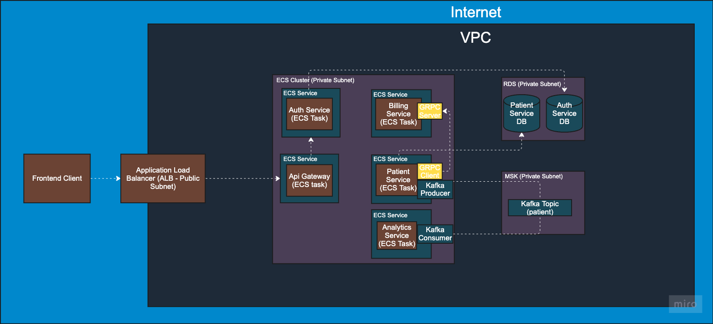

# Java Spring Microservices – Learning & Improvements

This project is a **fork** of [chrisblakely01/java-spring-microservices](https://github.com/chrisblakely01/java-spring-microservices), originally built to demonstrate a microservice architecture using Java, Spring Boot, PostgreSQL, and Kafka. I used it as a **hands-on learning resource** to understand modern microservice design patterns, DevOps principles, and gRPC integration.

---

## 🔍 What I Learned

- **Spring Boot Microservice Structure**: How to separate concerns into distinct services.
- **Service Communication**:
    - REST for external API communication
    - Kafka for asynchronous messaging between services
    - gRPC for efficient internal RPCs (planned improvement)
- **Dockerization**: Containerizing services and databases.
- **Service Discovery (Planned)**: Currently, services communicate via hardcoded URLs—will explore Eureka or Kubernetes-native DNS discovery.
- **Data Consistency**: Event-driven patterns with Kafka for syncing data between services.

---
### 💡 Suggestions for Future Improvements
- Add Redis caching to improve performance and reduce database load 
- Implement rate limiting and protect your APIs from abuse using Spring Cloud Gateway 
- Set up Prometheus and Grafana monitoring for production-grade observability 
- Use Resilience4j circuit breakers and fallbacks for reliable inter-service communication 
- Integrate advanced testing: Rest Assured, Testcontainers, and automated rate limit tests 
- Deploy with Docker, AWS CDK, and ECS Fargate — production-ready infrastructure, locally or in the cloud
- Create a new repo: `grpc-protos-repo` (or folder within monorepo if preferred)
- Move all `.proto` files (e.g., for `BillingService`, `PatientService`) there
- Integrate this repo as a **Git submodule** inside each service
- Update `build.gradle` or `pom.xml` in each service to generate stubs from the shared `.proto`
- Automate build, test, and deployment using GitHub Actions (with Docker + Maven workflows)

---

## 📊 Architecture Diagram (Planned)

A visual representation of the service interactions is being developed. This will include:

- REST API entry points
- gRPC request paths (once implemented)
- Database interactions

##  Kafka event flows

##  AWS cloud architecture

> Will be published soon as PNG + Mermaid syntax.

---

## 🧪 Tech Stack

- Java 17
- Spring Boot
- Kafka
- PostgreSQL
- Docker / Docker Compose
- Maven

---

# 🤝 Acknowledgements

Huge thanks to @chrisblakely01 for the original implementation. This fork exists purely for educational purposes and to serve as a base for continued experimentation and architectural improvements.
